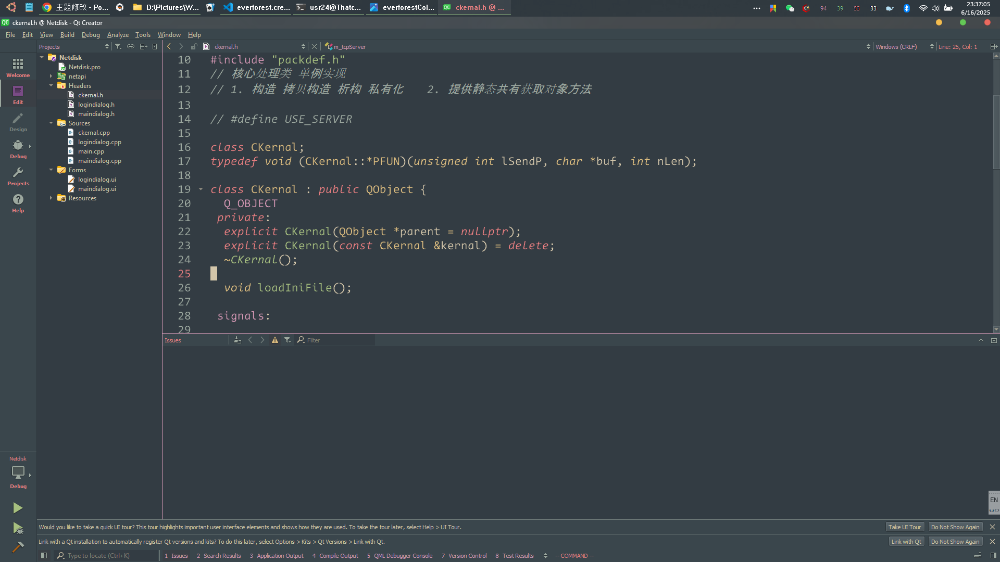

# Everforest QtCreator Theme

A QtCreator port of [Everforest](https://github.com/sainnhe/everforest) theme. 
I use ai to modify other color schemes 
You can take whatever you want

---

---

# Installation

- cut/copy `everforest.creatortheme` into `E:\Qt\Tools\QtCreator\share\qtcreator\themes`

- cut/copy `everforest.xml` into `E:\Qt\Tools\QtCreator\share\qtcreator\styles`

As you can see that's my Installation Path , you should find yours ,replace it